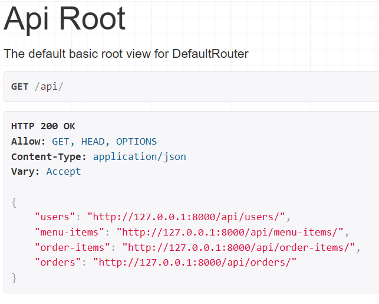

# Baguette API

## Setting up development environment

The recommended way of developing this Django API is through a virtual environment, as there are a lot of dependencies.

```bash
# Create virtual environment
python -m venv .venv

# Windows
.\.venv\Scripts\activate

# Unix
source .venv/bin/activate

pip install -r requirements.txt
```

## Creating & populating the database

These four commands are essential to run when starting and during development:

```bash
python manage.py makemigrations
python manage.py migrate
python prepopulate.py
python manage.py runserver
```

Make migrations: Observes changes made to the models, and **must be run every time when a model is altered to use the latest versions of the models**.

Migrate: Applies the observed changes to models, and creates the database file.

Pre-populate: Adds random information to all models in the database.

Run server: Starts the development server. Adding the endpoint **/api/** to the URL of the development server takes you to the API Root.



# Structure overview

## /baguettes

Contains most of the files that are to be altered by the developers. The most important ones are explained below:

### /models.py

Features the actual models and their fields. Changes here include altering, adding, or removing fields or models.

### /serializers.py

Features the serializers for the models. Changes impact how data is shown on the server. 

### /views.py

Responsible for creating the viewsets for the models and their information based on the items in the database.

### /urls.py

Defines where the resources are located on the API page.

## /project

Has mostly configuration files. There is no need to change these (at least often, mostly changes affect **/settings.py**). 